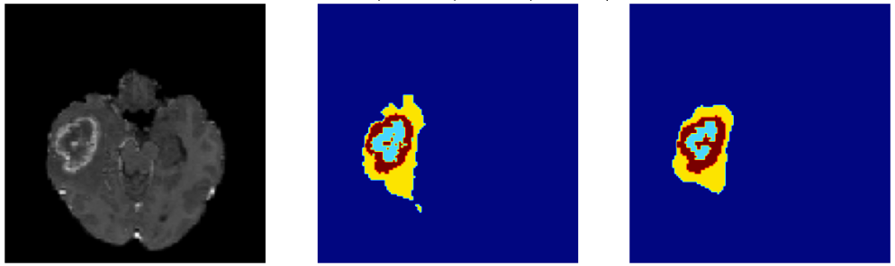

# nnU-Net for Brain Tumor Segmentation (MLIA)
#### Group 5 - Connor Cole, Shen Zhu, Zoraiz Qureshi (cdc3hf, sz9jt, zce5py)



On a GPU-powered HPC cluster (Rivanna) or local machine. 
Clone repository, and cd into it. All scripts should be run from inside the cloned main directory.
```
git clone https://github.com/MIC-DKFZ/nnUNet.git
cd nnUNet
```

We provide a modified version of the source nnUNet github repository (some edits were to internal trainer classes), which also has some of our main custom bash and python scripts - for everything from pre-processing, downloading structured & pre-processed data, preparation, training, predictions, evaluation, and visualization. 

```
source setup.sh
```

Before dataset prep steps, it is ideal to remove current folders setup and start from scratch:
```
rm -rf nnUNet_raw_data_base
rm -rf nnUNet_preprocessed
rm -rf nnUNet_trained_models
```

The next script downloads a pre-processed, structured dataset, unzips to the right paths, creates associated metadata files for training. To go through our pre-processing, have a look at `preprocessing.ipynb`.
```
source prep_dataset.sh
```

Make sure the following paths exist with relevant files before proceeding as well in the current directory:
```
nnUNet_preprocessed/Task500_BrainTumor/nnUNetPlansv2.1_plans_2D.pkl
nnUNet_preprocessed/Task500_BrainTumor/nnUNetData_plans_v2.1_2D_stage0
...
nnUNet_raw_data_base/nnUNet_raw_data/Task500_BrainTumor/imagesTr
nnUNet_raw_data_base/nnUNet_raw_data/Task500_BrainTumor/labelsTr
nnUNet_raw_data_base/nnUNet_raw_data/Task500_BrainTumor/imagesTs
nnUNet_raw_data_base/nnUNet_raw_data/Task500_BrainTumor/labelsTs
```

Once the dataset is prepared you can follow either section based on training and evaluation requirements.

### Run one sample training, prediction, evaluation and visualization (fast)

Train, predict and evaluate a model using the best `nnUNetTrainerV2BraTSRegions_DA4_BN_BD` class. Should take ~1 hour on an A100 GPU and 16+ CPU threads.
```
python "nnunet/run/run_training.py" 2d nnUNetTrainerV2BraTSRegions_DA4_BN_BD Task500_BrainTumor all
```

Alternatively, if you would like to skip training, and use the pre-trained model for predictions download it from this [Google Drive link](https://drive.google.com/file/d/1JPkJMjT8dQja0S8RiA5EWYUVIlONGmJl/view?usp=sharing). Just unzip in the main directory.

Ensure you have the following paths and files inside the main repository before proceeding:
```
nnUNet_trained_models/nnUNet/2d/Task500_BrainTumor/nnUNetTrainerV2BraTSRegions_DA4_BN_BD__nnUNetPlansv2.1/all/
... model_final_checkpoint.model
... model_final_checkpoint.model.pkl
```

Next, to predict on test image data, run:
```
python "nnunet/inference/predict_simple.py" -i "nnUNet_raw_data_base/nnUNet_raw_data/Task500_BrainTumor/imagesTs" -o "nnUNet_raw_data_base/nnUNet_raw_data/Task500_BrainTumor/predTs_nnUNetTrainerV2BraTSRegions_DA4_BN_BD" -t Task500_BrainTumor -m 2d -tr nnUNetTrainerV2BraTSRegions_DA4_BN_BD -f all --save_npz
```

Open `sample_evaluate_visualize.ipynb`, and run all sections to get a metrics summary and visualization for the `nnUNetTrainerV2BraTSRegions_DA4_BN_BD` class.


### Batch-run all experiments (optional)


Optionally, if you want to batch train some existing trainer modules on certain folds (requires some manual edits). Training time per epoch (~40s) on A100, 16 CPU cores, 32 GB system RAM. Takes almost 1 hour per run (each fold per class).
```
source train.sh
```

You can also run predictions on the test set again directly, for saved best models trained for each improvement class on the training set.
Predict using specified saved trained models.
```
source predict.sh
```

To get final metrics and visualize test set predictions, please run sections of the `evaluate_visualize.ipynb`.


